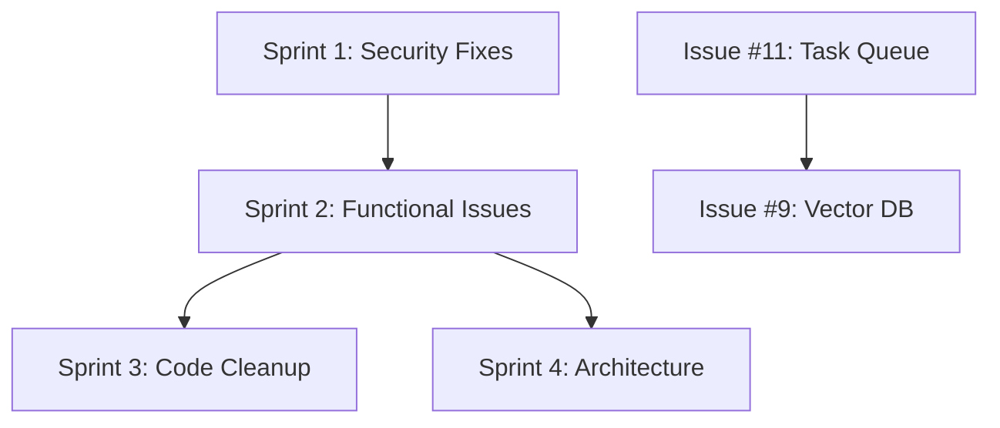

# LifeLine - Issue Tracking & Management System

## Overview
This document provides a systematic approach to tracking and managing all issues in the LifeLine project. Issues are categorized by priority, type, and component to ensure efficient resolution.

## Issue Categories

### Priority Levels
- 🔴 **Critical**: Security vulnerabilities, system-breaking bugs
- 🟡 **High**: Important functionality issues, production concerns
- 🟠 **Medium**: Feature improvements, performance optimizations
- 🟢 **Low**: Code cleanup, minor enhancements

### Issue Types
- 🔒 **Security**: Security vulnerabilities and concerns
- 🐛 **Bug**: Functional issues that need fixing
- ⚡ **Performance**: Performance and scalability improvements
- 🧹 **Cleanup**: Code quality and maintenance
- 🚀 **Enhancement**: New features or improvements
- ⚙️ **Configuration**: Settings and deployment issues

### Components
- 🖥️ **Backend**: Django REST API, models, utilities
- 🌐 **Frontend**: React application, UI components
- 🔧 **Infrastructure**: Deployment, configuration, dependencies
- 📧 **Integrations**: Gmail, external APIs

## Current Issues Status

### 🔴 Critical Priority Issues
| Issue | Title | Type | Component | Status | Assignee | Est. Effort |
|-------|-------|------|-----------|--------|----------|-------------|
| #42 | Fix middleware order - APICSRFExemptMiddleware | 🔒 Security | 🖥️ Backend | Open | - | 1h |
| #14 | Secure ALLOWED_HOSTS for production | 🔒 Security | 🔧 Infrastructure | Open | - | 2h |
| #10 | Improve production secret key security | 🔒 Security | 🔧 Infrastructure | Open | - | 1h |

### 🟡 High Priority Issues
| Issue | Title | Type | Component | Status | Assignee | Est. Effort |
|-------|-------|------|-----------|--------|----------|-------------|

### 🟠 Medium Priority Issues
| Issue | Title | Type | Component | Status | Assignee | Est. Effort |
|-------|-------|------|-----------|--------|----------|-------------|
| #51 | Fix inconsistent MIME construction in gmail_mcp.py | 🐛 Bug | 📧 Integrations | Open | - | 3h |
| #43 | Standardize CORS configuration | ⚙️ Configuration | 🔧 Infrastructure | Open | - | 2h |
| #13 | Pin numpy dependency version | ⚙️ Configuration | 🔧 Infrastructure | Open | - | 1h |
| #11 | Replace threading with proper background task queue | ⚡ Performance | 🖥️ Backend | Open | - | 8h |
| #9 | Optimize memory search with vector database | ⚡ Performance | 🖥️ Backend | Open | - | 16h |

### 🟢 Low Priority Issues
| Issue | Title | Type | Component | Status | Assignee | Est. Effort |
|-------|-------|------|-----------|--------|----------|-------------|
| #50 | Remove duplicate imports in gmail_mcp.py | 🧹 Cleanup | 📧 Integrations | Open | - | 0.5h |
| #44 | Remove redundant logic in APICSRFExemptMiddleware | 🧹 Cleanup | 🖥️ Backend | Open | - | 1h |
| #12 | Remove unused asyncio import | 🧹 Cleanup | 🖥️ Backend | Open | - | 0.5h |

## Work Plan - Sprint-based Approach

### Sprint 1: Critical Security Fixes (Priority: 🔴)
**Duration**: 1-2 days
**Goal**: Address all critical security issues

- [ ] **Issue #42**: Fix middleware order for CSRF exemption
  - **Risk**: High - API endpoints may fail CSRF validation
  - **Dependencies**: None
  - **Testing**: Verify API endpoints work without CSRF errors

- [ ] **Issue #14**: Secure ALLOWED_HOSTS for production
  - **Risk**: Medium - Security vulnerability in production
  - **Dependencies**: None
  - **Testing**: Test with environment variables

- [ ] **Issue #10**: Improve production secret key security
  - **Risk**: High - Production deployment may use insecure key
  - **Dependencies**: None
  - **Testing**: Verify error handling when key not set

### Sprint 2: High-Impact Medium Priority (Priority: 🟠)
**Duration**: 3-5 days
**Goal**: Fix functional bugs and configuration issues

- [ ] **Issue #51**: Fix Gmail MIME construction inconsistency
  - **Risk**: Medium - Email formatting issues
  - **Dependencies**: None
  - **Testing**: Send test emails with different formats

- [ ] **Issue #43**: Standardize CORS configuration
  - **Risk**: Low - Potential CORS conflicts
  - **Dependencies**: None
  - **Testing**: Test frontend-backend communication

- [ ] **Issue #13**: Pin numpy dependency version
  - **Risk**: Medium - Build reproducibility
  - **Dependencies**: None
  - **Testing**: Fresh environment installation

### Sprint 3: Code Cleanup (Priority: 🟢)
**Duration**: 1-2 days
**Goal**: Improve code quality and maintainability

- [ ] **Issue #50**: Remove duplicate imports in Gmail connector
- [ ] **Issue #12**: Remove unused asyncio import
- [ ] **Issue #44**: Clean up middleware logic

### Sprint 4: Architecture Improvements (Priority: 🟠)
**Duration**: 1-2 weeks
**Goal**: Implement long-term architecture improvements

- [ ] **Issue #11**: Replace threading with proper task queue
  - **Risk**: High - Current implementation lacks reliability
  - **Dependencies**: Research task queue options
  - **Testing**: Background task monitoring

- [ ] **Issue #9**: Implement vector database for memory search
  - **Risk**: Medium - Current approach doesn't scale
  - **Dependencies**: Vector database selection
  - **Testing**: Performance benchmarking

## Progress Tracking

### Completion Metrics
- **Total Issues**: 11
- **Completed**: 0
- **In Progress**: 0
- **Ready for Review**: 0
- **Blocked**: 0

### Sprint Progress
- **Sprint 1**: Not Started
- **Sprint 2**: Not Started
- **Sprint 3**: Not Started
- **Sprint 4**: Not Started

## Issue Dependencies

## Risk Assessment

### High Risk Issues
- **#42**: API functionality may be broken
- **#10**: Production security vulnerability
- **#11**: Unreliable background processing

### Medium Risk Issues
- **#14**: Production security concern
- **#51**: Email functionality issues
- **#9**: Scalability limitations

### Low Risk Issues
- **#43, #13, #50, #44, #12**: Code quality and configuration

## Testing Strategy

### Security Testing Checklist
- [ ] CSRF protection working correctly
- [ ] Environment variables properly validated
- [ ] Production deployment security verified

### Functional Testing Checklist
- [ ] Gmail integration working correctly
- [ ] Email sending/receiving functionality
- [ ] Memory extraction and retrieval
- [ ] Background task processing

### Integration Testing Checklist
- [ ] Frontend-backend communication
- [ ] API authentication and authorization
- [ ] Database operations
- [ ] External service integrations

## Monitoring and Reporting

### Daily Standup Questions
1. What issues were completed yesterday?
2. What issues are planned for today?
3. Are there any blockers or dependencies?

### Weekly Review Points
1. Sprint progress against goals
2. Risk assessment updates
3. Emerging issues or technical debt
4. Resource allocation adjustments

---

**Last Updated**: [Current Date]
**Next Review**: [Next Review Date]