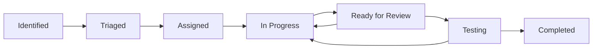

# LifeLine - Issue Management Workflow

## Workflow Overview

This document defines the systematic workflow for handling issues in the LifeLine project, from identification to resolution.

## Issue Lifecycle



## Issue Triage Process

### 1. Issue Identification
Issues can be identified through:
- GitHub Issues
- Code reviews
- User reports
- Security audits
- Performance monitoring
- Automated testing

### 2. Priority Assignment
Use the following criteria:

**🔴 Critical (P0)**
- Security vulnerabilities
- System-breaking bugs
- Data loss risks
- Production downtime

**🟡 High (P1)**
- Major functionality broken
- Performance degradation
- User experience issues
- Deployment blockers

**🟠 Medium (P2)**
- Feature improvements
- Minor bugs
- Performance optimizations
- Code quality issues

**🟢 Low (P3)**
- Code cleanup
- Documentation updates
- Nice-to-have features
- Non-blocking issues

### 3. Impact Assessment
Consider:
- **User Impact**: How many users are affected?
- **Business Impact**: Does it affect core functionality?
- **Technical Impact**: Does it affect system stability?
- **Security Impact**: Are there security implications?

## Work Assignment Strategy

### Sprint Planning
- **Sprint Duration**: 1-2 weeks
- **Capacity Planning**: Based on team availability
- **Priority Focus**: Complete higher priority items first
- **Risk Mitigation**: Address risky items early

### Task Breakdown
For each issue:
1. **Analysis Phase** (10-20% of effort)
   - Root cause analysis
   - Solution design
   - Impact assessment
   - Testing strategy

2. **Implementation Phase** (60-70% of effort)
   - Code changes
   - Unit testing
   - Integration testing
   - Documentation updates

3. **Review Phase** (10-20% of effort)
   - Code review
   - Testing verification
   - Performance validation
   - Security review

## Development Workflow

### 1. Issue Assignment
- Assign based on expertise and availability
- Set clear expectations and deadlines
- Define success criteria

### 2. Development Process
```bash
# 1. Create feature branch
git checkout -b fix/issue-{number}-{description}

# 2. Make incremental changes
git add .
git commit -m "Fix #{number}: {description}"

# 3. Push and create PR
git push origin fix/issue-{number}-{description}
```

### 3. Code Review Checklist
- [ ] Code follows project standards
- [ ] Tests are included and passing
- [ ] Documentation is updated
- [ ] No security vulnerabilities introduced
- [ ] Performance impact assessed
- [ ] Breaking changes identified

### 4. Testing Strategy
- [ ] Unit tests pass
- [ ] Integration tests pass
- [ ] Manual testing completed
- [ ] Performance testing (if applicable)
- [ ] Security testing (if applicable)

## Quality Gates

### Before Starting Work
- [ ] Issue is properly triaged
- [ ] Requirements are clear
- [ ] Acceptance criteria defined
- [ ] Dependencies identified

### Before Code Review
- [ ] All tests passing locally
- [ ] Code is self-documenting
- [ ] Edge cases handled
- [ ] Error handling implemented

### Before Merging
- [ ] Code review approved
- [ ] All automated tests pass
- [ ] Manual testing completed
- [ ] Documentation updated

### Before Closing Issue
- [ ] Functionality verified in environment
- [ ] User acceptance criteria met
- [ ] No regressions introduced
- [ ] Monitoring in place (if needed)

## Communication Guidelines

### Status Updates
- Daily progress updates for critical issues
- Weekly summaries for ongoing work
- Immediate escalation for blockers

### Documentation Requirements
- Technical decisions documented
- Breaking changes highlighted
- Migration guides provided
- API changes documented

## Automation Tools

### GitHub Integration
```yaml
# .github/ISSUE_TEMPLATE/bug_report.md
---
name: Bug Report
about: Create a report to help us improve
title: '[BUG] '
labels: 'bug'
assignees: ''
---

**Priority**: [P0/P1/P2/P3]
**Component**: [Backend/Frontend/Infrastructure/Integration]
**Description**: Brief description of the issue

**Steps to Reproduce**:
1. Step 1
2. Step 2
3. Step 3

**Expected Behavior**: What should happen
**Actual Behavior**: What actually happens
**Environment**: Development/Staging/Production
```

### Automated Workflows
```yaml
# .github/workflows/issue-triage.yml
name: Issue Triage
on:
  issues:
    types: [opened]
jobs:
  triage:
    runs-on: ubuntu-latest
    steps:
      - name: Add to project
        uses: actions/add-to-project@v0.3.0
      - name: Set initial labels
        uses: actions/github-script@v6
```

## Metrics and KPIs

### Velocity Metrics
- Issues completed per sprint
- Average time to resolution
- Cycle time by priority
- Defect escape rate

### Quality Metrics
- Code coverage percentage
- Number of regressions
- Customer satisfaction scores
- Technical debt ratio

### Operational Metrics
- Mean time to detection (MTTD)
- Mean time to resolution (MTTR)
- First-time fix rate
- Escalation rate

## Escalation Procedures

### When to Escalate
- Critical issues not resolved within SLA
- Resource conflicts or blockers
- Technical decisions requiring input
- Security incidents

### Escalation Channels
1. **Team Lead**: Technical guidance and resource allocation
2. **Project Manager**: Timeline and priority conflicts
3. **Architecture Team**: Technical design decisions
4. **Security Team**: Security-related issues

## Templates

### Issue Update Template
```markdown
## Progress Update - Issue #{number}

**Status**: [In Progress/Blocked/Ready for Review]
**Progress**: {percentage}% complete

**Work Completed**:
- Item 1
- Item 2

**Next Steps**:
- Next action 1
- Next action 2

**Blockers/Risks**:
- None / List any blockers

**ETA**: {estimated completion date}
```

### Post-Mortem Template
```markdown
## Post-Mortem - Issue #{number}

**Issue Summary**: Brief description
**Root Cause**: What caused the issue
**Resolution**: How it was fixed
**Lessons Learned**: Key takeaways
**Action Items**: Preventive measures
```

---

**Document Version**: 1.0
**Last Updated**: [Current Date]
**Owner**: Development Team