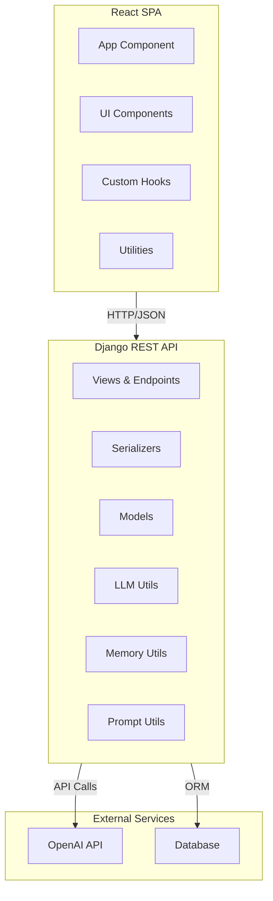
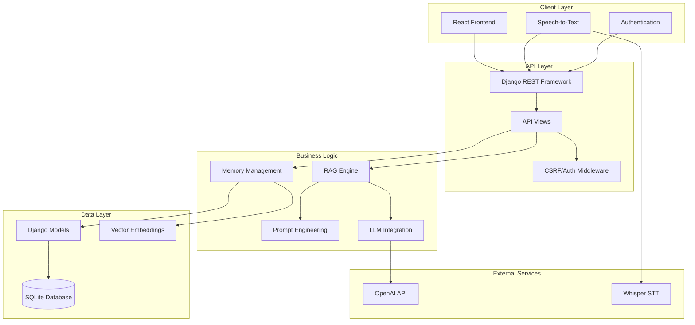

# LifeLine — AI Assistant with Persistent Memory and RAG

LifeLine is an AI-powered conversational assistant that remembers important user details across sessions, offers
multiple chat modes, and supports speech-to-text. It combines a React frontend with a Django REST backend and deep
OpenAI integration for retrieval-augmented generation (RAG).

## 🌟 Key Features

• **Multiple AI Models**: GPT-4.1 Nano, GPT-4o, GPT-4o Mini, GPT-4.1 for balanced performance and cost.  
• **Persistent Memory**: LLM-driven extraction and storage of personal info, preferences, goals, insights, and
context.  
• **Retrieval-Augmented Generation**: Semantic embeddings and cosine similarity to fetch relevant memories
dynamically.  
• **Flexible Chat Modes**: Conversational, Coaching, Therapeutic, Productivity, and Creative modes with mode-specific
system prompts.  
• **Speech-to-Text**: Real-time audio recording and transcription using OpenAI Whisper models.  
• **Robust Debugging**: Full prompt logging, token and memory metrics, and a dedicated `PromptDebug` model.  
• **Secure Authentication**: Token-based auth with optional CSRF exemption middleware for API endpoints.

## 🏗️ High-Level Architecture Overview

### Memory & Context Management

- **Automatic Memory Extraction**: LLM-powered extraction of personal information, preferences, goals, and insights
- **Semantic Memory Search**: Vector embeddings for intelligent memory retrieval
- **Memory Types**: Personal, Preferences, Goals, Insights, Facts, and Context
- **Conversation Continuity**: Maintains context across multiple conversations
- **Enhanced Prompting**: Dynamic prompt construction with memory context and conversation history

1. **Frontend (React)**
    - Single-page application built with Create React App.
    - Key UI components: `Header`, `ChatSidebar`, `ChatWindow`, `ChatInput`, `Login`, `SignUp`.
    - Custom hooks: `useAuth`, `useConversations`, `useSpeechToText`, `useMobileLayout`.
    - Utilities: `apiUtils.fetchWithAuth` for API calls; `speechUtils.isSTTSupported` for microphone permissions.

2. **Backend (Django REST Framework)**
    - REST API endpoints under `/api/` for login, registration, conversations, messages, memories, notes, and
      transcription.
    - Models: `User`, `Conversation`, `Message`, `Memory`, `PromptDebug`, `MessageNote`.
    - Serializers to validate and format JSON payloads.
    - Views orchestrate RAG: retrieve memories, build enhanced prompts, call OpenAI APIs, store debug info.
    - Utility modules:
        - **`llm.py`**: OpenAI client, text generation, transcription, TTS, embeddings.
        - **`memory_utils.py`**: Cosine similarity, memory extraction/storage, retrieval, ranking.
        - **`prompts.py`**: Mode-specific system prompts, memory/context formatting, conversation history.
    - Middleware for selective CSRF exemption on token-based API routes.

### Component Diagram



### System Architecture



### UML Class Diagram

```mermaid
classDiagram
    class User {
        +int id
        +string username
        +string email
        +datetime date_joined
        +bool is_active
    }
    
    class Conversation {
        +int id
        +string title
        +datetime created_at
        +datetime updated_at
        +bool is_archived
        +json context
        +get_message_count()
    }
    
    class Message {
        +int id
        +string content
        +datetime created_at
        +bool is_bot
        +string role
        +json metadata
        +string full_prompt
        +string raw_user_input
    }
    
    class Memory {
        +int id
        +string content
        +string title
        +string memory_type
        +float importance_score
        +json embedding
        +json tags
        +datetime created_at
        +int access_count
        +bool is_auto_extracted
        +update_access()
    }
    
    class PromptDebug {
        +int id
        +string full_prompt
        +string system_prompt
        +string memory_context
        +string model_used
        +string mode_used
        +int prompt_tokens
        +int response_tokens
        +int memories_used_count
        +int response_time_ms
        +datetime created_at
    }
    
    class MessageNote {
        +int id
        +string note
        +datetime created_at
    }
    
    User ||--o{ Conversation : owns
    User ||--o{ Message : sends
    User ||--o{ Memory : has
    User ||--o{ MessageNote : creates
    Conversation ||--o{ Message : contains
    Conversation ||--o{ Memory : generates
    Conversation ||--o{ PromptDebug : logs
    Message ||--o{ MessageNote : annotated_with
    Message ||--o{ Memory : extracts
    Message ||--|| PromptDebug : debugged_by
```

## 🚀 Getting Started

### Prerequisites

- Python 3.8+
- Node.js 14+
- OpenAI API key
- AWS EC2 instance (for production deployment)
- Domain name or free subdomain (recommended for trusted SSL)

### Local Development Setup

#### Backend Setup

1. **Clone the repository**
   ```bash
   git clone <repository-url>
   cd lifeline/backend
   ```

2. **Create virtual environment**
   ```bash
   python -m venv venv
   source venv/bin/activate  # On Windows: venv\Scripts\activate
   ```

3. **Install dependencies**
   ```bash
   pip install -r requirements.txt
   ```

4. **Environment variables**
   Create a `.env` file in the backend/LifeLine directory:
   ```env
   OPENAI_API_KEY=your_openai_api_key_here
   DJANGO_SECRET_KEY=your_django_secret_key_here
   DEBUG=True
   ALLOWED_HOSTS=localhost,127.0.0.1
   ```

5. **Database setup**
   ```bash
   cd LifeLine
   python manage.py migrate
   python manage.py collectstatic --noinput
   ```

6. **Create Django superuser (for admin access)**
   ```bash
   python manage.py createsuperuser
   ```
   Follow the prompts to create an admin username, email, and password.

7. **Run development server**
   ```bash
   python manage.py runserver 8000
   ```

8. **Access Django Admin**
    - Admin Interface: http://localhost:8000/admin
    - Login with your superuser credentials
    - Manage users, conversations, messages, and memories

#### Frontend Setup

1. **Navigate to frontend directory**
   ```bash
   cd lifeline/frontend
   ```

2. **Install dependencies**
   ```bash
   npm install
   ```

3. **Configure API endpoint**
   Update `src/config.js` if needed:
   ```javascript
   const config = {
     API_BASE_URL: process.env.NODE_ENV === 'production' 
       ? '/api' 
       : 'http://localhost:8000/api'
   };
   ```

4. **Run development server**
   ```bash
   npm start
   ```

5. **Access the application**
    - Frontend: http://localhost:3000
    - Backend API: http://localhost:8000/api

## 🌐 Production Deployment

### Option 1: Deploy with IP Address (Quick Testing)

1. **Set up GitHub Secrets**
   Go to your repository → Settings → Secrets and variables → Actions:
    - `EC2_SSH_PRIVATE_KEY`: Your EC2 private key
    - `EC2_HOSTNAME`: Your EC2 public IP address
    - `EC2_USER_NAME`: `ec2-user` (for Amazon Linux)
    - `DJANGO_SECRET_KEY`: Generate with
      `python -c "from django.core.management.utils import get_random_secret_key; print(get_random_secret_key())"`
    - `OPENAI_API_KEY`: Your OpenAI API key

2. **EC2 Security Groups**
   Ensure your EC2 instance allows:
    - HTTP (port 80) from anywhere
    - HTTPS (port 443) from anywhere
    - SSH (port 22) from your IP

3. **Deploy**
    - Push to main branch or manually trigger GitHub Action
    - Access via `https://your-ec2-ip` (will show SSL warning)

### Option 2: Deploy with Trusted SSL (Recommended)

#### Step 1: Get a Free Domain

**Using DuckDNS (Recommended):**

1. Go to https://www.duckdns.org/
2. Sign in with Google/GitHub
3. Create a subdomain: `lifeline-yourname.duckdns.org`
4. Point it to your EC2 public IP address
5. Copy your DuckDNS token

**Alternative Free DNS Services:**

- **No-IP**: https://www.noip.com/ (30 hostnames free)
- **FreeDNS**: https://freedns.afraid.org/ (completely free)
- **Dynu**: https://www.dynu.com/ (4 hostnames free)

#### Step 2: Update GitHub Secrets

1. **Update existing secrets:**
    - Change `EC2_HOSTNAME` from IP to your domain: `lifeline-yourname.duckdns.org`

2. **Optional: Add DuckDNS auto-update (for dynamic IPs):**
    - `DUCKDNS_TOKEN`: Your DuckDNS token (if using DuckDNS)

#### Step 3: Deploy

1. **Push your code** or manually trigger the GitHub Action
2. **Wait for deployment** (takes 3-5 minutes)
3. **Access your app** at `https://lifeline-your-name.duckdns.org`

### Deployment Features

The deployment script automatically:

- ✅ **Detects IP vs Domain**: Uses appropriate SSL certificate method
- ✅ **Let's Encrypt SSL**: Automatic trusted certificates for domains
- ✅ **Self-signed SSL**: Fallback for IP addresses
- ✅ **Auto-renewal**: Certificates automatically renew before expiration
- ✅ **HTTPS Redirect**: All HTTP traffic redirected to HTTPS
- ✅ **Service Management**: Systemd services for backend and nginx
- ✅ **Error Handling**: Comprehensive logging and debugging

### Production Django Admin Access

After deployment, you'll need to create a superuser on your EC2 instance:

1. **SSH into your EC2 instance**
   ```bash
   ssh -i your-key.pem ec2-user@your-domain-or-ip
   ```

2. **Create superuser**
   ```bash
   cd /home/ec2-user/lifeline/backend/LifeLine
   source /home/ec2-user/lifeline/venv/bin/activate
   python manage.py createsuperuser
   ```

3. **Access production admin**
    - Admin Interface: `https://your-domain-or-ip/admin`
    - Login with your superuser credentials
    - Manage production users, conversations, and memories

**What you can do in Django Admin:**

- 👥 **User Management**: View registered users, reset passwords, manage permissions
- 💬 **Conversations**: Browse all user conversations, delete inappropriate content
- 📝 **Messages**: View chat messages, monitor API usage
- 🧠 **Memories**: Inspect extracted memories, debug memory extraction
- 🔧 **System Monitoring**: Check database health, view logs

## 🔧 Configuration

### Environment Variables

#### Backend (.env or GitHub Secrets)

```env
# Required
OPENAI_API_KEY=sk-your-openai-key
DJANGO_SECRET_KEY=your-secret-key

# Optional
DEBUG=False                    # Set to True for development
ALLOWED_HOSTS=yourdomain.com   # Your domain or IP
DATABASE_URL=sqlite:///db.sqlite3  # Default SQLite
```

#### Frontend (config.js)

```javascript
const config = {
    API_BASE_URL: process.env.NODE_ENV === 'production'
        ? '/api'  // Production: served by nginx
        : 'http://localhost:8000/api',  // Development

    // Speech-to-text settings
    STT_ENABLED: true,
    STT_LANGUAGE: 'en-US',

    // Chat settings
    DEFAULT_MODEL: 'gpt-4o-mini',
    MAX_MESSAGE_LENGTH: 4000
};
```

### AI Model Configuration

Available models in `backend/LifeLine/api/utils/llm.py`:

- `gpt-4o`: Most capable, higher cost
- `gpt-4o-mini`: Balanced performance and cost (default)
- `gpt-4-turbo`: Previous generation, still powerful
- `gpt-3.5-turbo`: Fastest, most economical

### Memory System Configuration

Memory extraction settings in `backend/LifeLine/api/utils/memory_utils.py`:

- **Memory Types**: Personal, Preferences, Goals, Insights, Facts, Context
- **Extraction Threshold**: Minimum conversation length for memory extraction
- **Similarity Threshold**: Vector similarity cutoff for memory retrieval
- **Max Memories**: Maximum number of memories to include in context

## 🔍 Troubleshooting

### Common Issues

**SSL Certificate Issues:**

- Ensure your domain points to your EC2 IP
- Check port 80 is accessible for Let's Encrypt verification
- Wait 2-3 minutes after DNS changes before deploying

**Voice Input Not Working:**

- HTTPS is required for microphone access
- Check browser microphone permissions
- Ensure you're not using localhost in production

**Backend API Errors:**

- Check Django logs: `sudo journalctl -u lifeline-backend -f`
- Verify environment variables are set correctly
- Ensure OpenAI API key is valid and has credits

**Frontend Not Loading:**

- Check nginx logs: `sudo tail -f /var/log/nginx/error.log`
- Verify file permissions: `ls -la /home/ec2-user/lifeline/frontend/`
- Confirm nginx is serving files from correct directory

### Debugging Commands

**Check service status:**

```bash
sudo systemctl status lifeline-backend
sudo systemctl status nginx
```

**View logs:**

```bash
# Backend logs
sudo journalctl -u lifeline-backend -f

# Nginx logs  
sudo tail -f /var/log/nginx/access.log
sudo tail -f /var/log/nginx/error.log
```

**Test SSL certificate:**

```bash
sudo certbot certificates
openssl s_client -connect yourdomain.com:443
```

**Manual restart services:**

```bash
sudo systemctl restart lifeline-backend
sudo systemctl restart nginx
```

## 🤝 Contributing

1. Fork the repository
2. Create a feature branch (`git checkout -b feature/amazing-feature`)
3. Commit your changes (`git commit -m 'Add amazing feature'`)
4. Push to the branch (`git push origin feature/amazing-feature`)
5. Open a Pull Request

## 📄 License

This project is licensed under the MIT License - see the [LICENSE](LICENSE) file for details.

## 🆘 Support

- **Issues**: https://github.com/your-repo/lifeline/issues
- **Documentation**: Check this README and inline code comments
- **Deployment Help**: See the `setup-duckdns.md` guide for domain setup

## 🔄 Updates

The application automatically updates when you push to the main branch. The GitHub Action will:

1. Build the frontend
2. Deploy to your EC2 instance
3. Restart services
4. Verify deployment health

Monitor deployment status in the GitHub Actions tab of your repository.
