# LifeLine — AI Assistant with Persistent Memory and RAG

LifeLine is an AI-powered conversational assistant that remembers important user details across sessions, offers
multiple chat modes, and supports speech-to-text. It combines a React frontend with a Django REST backend and deep
OpenAI integration for retrieval-augmented generation (RAG).

## 🌟 Key Features

• **Multiple AI Models**: GPT-4.1 Nano, GPT-4o, GPT-4o Mini, GPT-4.1 for balanced performance and cost.  
• **Persistent Memory**: LLM-driven extraction and storage of personal info, preferences, goals, insights, and
context.  
• **Retrieval-Augmented Generation**: Semantic embeddings and cosine similarity to fetch relevant memories
dynamically.  
• **Flexible Chat Modes**: Conversational, Coaching, Therapeutic, Productivity, and Creative modes with mode-specific
system prompts.  
• **Speech-to-Text**: Real-time audio recording and transcription using OpenAI Whisper models.  
• **Robust Debugging**: Full prompt logging, token and memory metrics, and a dedicated `PromptDebug` model.  
• **Secure Authentication**: Token-based auth with optional CSRF exemption middleware for API endpoints.  
• **Gmail MCP Connector (OAuth2)**: Authenticate a user’s Gmail account (read / send / labels / modify) via Google OAuth
with refresh token support and per-user credential storage.

## 🏗️ High-Level Architecture Overview

### Memory & Context Management

- **Automatic Memory Extraction**: LLM-powered extraction of personal information, preferences, goals, and insights
- **Semantic Memory Search**: Vector embeddings for intelligent memory retrieval
- **Memory Types**: Personal, Preferences, Goals, Insights, Facts, and Context
- **Conversation Continuity**: Maintains context across multiple conversations
- **Enhanced Prompting**: Dynamic prompt construction with memory context and conversation history

1. **Frontend (React)**
    - Single-page application built with Create React App.
    - Key UI components: `Header`, `ChatSidebar`, `ChatWindow`, `ChatInput`, `Login`, `SignUp`.
    - Custom hooks: `useAuth`, `useConversations`, `useSpeechToText`, `useMobileLayout`.
    - Utilities: `apiUtils.fetchWithAuth` for API calls; `speechUtils.isSTTSupported` for microphone permissions.

2. **Backend (Django REST Framework)**
    - REST API endpoints under `/api/` for login, registration, conversations, messages, memories, notes, and
      transcription.
    - Models: `User`, `Conversation`, `Message`, `Memory`, `PromptDebug`, `MessageNote`.
    - Models: `User`, `Conversation`, `Message`, `Memory`, `PromptDebug`, `MessageNote`, `MCPConnector`, `MCPOperation`.
    - Serializers to validate and format JSON payloads.
    - MCP Views: Gmail OAuth flow, connector management, email operations.
    - Utility modules:
        - **`llm.py`**: OpenAI client, text generation, transcription, TTS, embeddings.
        - **`memory_utils.py`**: Cosine similarity, memory extraction/storage, retrieval, ranking.
        - **`gmail_mcp.py`**: Gmail OAuth 2.0 integration, email operations (send/read/search/labels).
    - Middleware for selective CSRF exemption on token-based API routes.

### Component Diagram

```mermaid
flowchart TD
    subgraph Frontend ["React SPA"]
        A[App Component]
        B[UI Components]
        C[Custom Hooks]
        D[Utilities]
    end
    E[ConnectorsTab]

subgraph Backend ["Django REST API"]
E[Views & Endpoints]
F[Views & Endpoints]
G[Serializers]
H[Models]
I[LLM Utils]
J[Memory Utils]
K[Prompt Utils]
L[MCP Utils]
M[Gmail MCP]

subgraph External ["External Services"]
K[OpenAI API]
N[OpenAI API]
O[Database]
P[Google OAuth]
Q[Gmail API]

Frontend -->|HTTP/JSON|Backend
Backend -->|API Calls|K
Backend -->|API Calls|N
Backend -->|ORM|O
Backend -->|OAuth Flow|P
Backend -->|Email Operations|Q
E -->|Connector Management|L
L -->|Gmail Integration|M

### System Architecture

```mermaid
graph TB
subgraph Client ["Client Layer"]
UI[React Frontend]
STT[Speech-to-Text]
Auth[Authentication]
end
Connectors[MCP Connectors UI]

subgraph API ["API Layer"]
REST[Django REST Framework]
Views[API Views]
Middleware[CSRF/Auth Middleware]
end
OAuth[OAuth Callbacks]

subgraph Business ["Business Logic"]
Memory[Memory Management]
RAG[RAG Engine]
Prompts[Prompt Engineering]
LLM[LLM Integration]
end
MCP[MCP Connector Management]
Gmail[Gmail MCP Server]

subgraph Data ["Data Layer"]
Models[Django Models]
DB[(SQLite Database)]
Embeddings[Vector Embeddings]
end
Credentials[OAuth Credentials Storage]

subgraph External ["External Services"]
OpenAI[OpenAI API]
Whisper[Whisper STT]
end
GoogleOAuth[Google OAuth 2.0]
GmailAPI[Gmail API]

UI --> REST
STT --> REST
Auth --> REST
REST --> Views
Connectors --> REST
Views --> Middleware
REST --> OAuth
Views --> Memory
Views --> RAG
Memory --> Models
Views --> MCP
RAG --> LLM
RAG --> Prompts
LLM --> OpenAI
MCP --> Gmail
STT --> Whisper
Models --> DB
OAuth --> GoogleOAuth
Gmail --> GmailAPI
Memory --> Embeddings
```

    Gmail --> Credentials

### UML Class Diagram

```mermaid
classDiagram
%% ─────── Domain Objects ───────
    class User {
        +int id
        +string username
        +string email
        +datetime date_joined
        +bool is_active
    }

    class Conversation {
        +int id
        +string title
        +datetime created_at
        +datetime updated_at
        +bool is_archived
        +json context
        +get_message_count()
    }

    class Message {
        +int id
        +string content
        +datetime created_at
        +bool is_bot
        +string role
        +json metadata
        +string full_prompt
        +string raw_user_input
    }

    class Memory {
        +int id
        +string content
        +string title
        +string memory_type
        +float importance_score
        +json embedding
        +json tags
        +datetime created_at
        +int access_count
        +bool is_auto_extracted
        +update_access()
    }

    class PromptDebug {
        +int id
        +string full_prompt
        +string system_prompt
        +string memory_context
        +string model_used
        +string mode_used
        +int prompt_tokens
        +int response_tokens
        +int memories_used_count
        +int response_time_ms
        +datetime created_at
    }

    class MessageNote {
        +int id
        +string note
        +datetime created_at
    }

    class MCPConnector {
        +int id
        +string connector_type
        +string name
        +string status
        +bool is_enabled
        +string client_id
        +string client_secret
        +string redirect_uri
        +json scopes
        +json config
        +datetime created_at
        +datetime updated_at
        +datetime last_authenticated
        +datetime last_used
        +mark_as_authenticated()
        +mark_as_used()
        +mark_as_error()
    }

    class MCPOperation {
        +int id
        +string operation_type
        +string status
        +json request_data
        +json response_data
        +string error_message
        +datetime started_at
        +datetime completed_at
        +int duration_ms
        +mark_completed()
    }

%% ─────── Relationships ───────
User "1"      o-- "many" Conversation: creates
User "1"      o-- "many" Message: writes
User "1"      o-- "many" Memory: owns
User "1"      o-- "many" MessageNote: annotates
User "1"      o-- "many" MCPConnector: uses

Conversation "1" o-- "many" Message: contains
MCPConnector "1" o-- "many" MCPOperation: performs
```



## 🚀 Getting Started

### Prerequisites

- Python 3.8+
- Node.js 14+
- OpenAI API key
- AWS EC2 instance (for production deployment)
- Domain name or free subdomain (recommended for trusted SSL)

### Local Development Setup

#### Backend Setup

1. **Clone the repository**
   ```bash
   git clone <repository-url>
   cd lifeline/backend
   ```

2. **Create virtual environment**
   ```bash
   python -m venv venv
   source venv/bin/activate  # On Windows: venv\Scripts\activate
   ```

3. **Install dependencies**
   ```bash
   pip install -r requirements.txt
   ```

4. **Environment variables**
   Create a `.env` file in the backend/LifeLine directory:
   ```env
   OPENAI_API_KEY=your_openai_api_key_here
   DJANGO_SECRET_KEY=your_django_secret_key_here
   DEBUG=True
   ALLOWED_HOSTS=localhost,127.0.0.1
   ```

5. **Database setup**
   ```bash
   cd LifeLine
   python manage.py migrate
   python manage.py collectstatic --noinput
   ```

6. **Create Django superuser (for admin access)**
   ```bash
   python manage.py createsuperuser
   ```
   Follow the prompts to create an admin username, email, and password.

7. **Run development server**
   ```bash
   python manage.py runserver 8000
   ```

8. **Access Django Admin**
    - Admin Interface: http://localhost:8000/admin
    - Login with your superuser credentials
    - Manage users, conversations, messages, and memories

#### Frontend Setup

1. **Navigate to frontend directory**
   ```bash
   cd lifeline/frontend
   ```

2. **Install dependencies**
   ```bash
   npm install
   ```

3. **Configure API endpoint**
   Update `src/config.js` if needed:
   ```javascript
   const config = {
     API_BASE_URL: process.env.NODE_ENV === 'production' 
       ? '/api' 
       : 'http://localhost:8000/api'
   };
   ```

4. **Run development server**
   ```bash
   npm start
   ```

5. **Access the application**
    - Frontend: http://localhost:3000
    - Backend API: http://localhost:8000/api

## 🌐 Production Deployment

### Option 1: Deploy with IP Address (Quick Testing)

1. **Set up GitHub Secrets**
   Go to your repository → Settings → Secrets and variables → Actions:
    - `EC2_SSH_PRIVATE_KEY`: Your EC2 private key
    - `EC2_HOSTNAME`: Your EC2 public IP address
    - `EC2_USER_NAME`: `ec2-user` (for Amazon Linux)
    - `DJANGO_SECRET_KEY`: Generate with
      `python -c "from django.core.management.utils import get_random_secret_key; print(get_random_secret_key())"`
    - `OPENAI_API_KEY`: Your OpenAI API key

2. **EC2 Security Groups**
   Ensure your EC2 instance allows:
    - HTTP (port 80) from anywhere
    - HTTPS (port 443) from anywhere
    - SSH (port 22) from your IP

3. **Deploy**
    - Push to main branch or manually trigger GitHub Action
    - Access via `https://your-ec2-ip` (will show SSL warning)

### Option 2: Deploy with Trusted SSL (Recommended)

#### Step 1: Get a Free Domain

**Using DuckDNS (Recommended):**

1. Go to https://www.duckdns.org/
2. Sign in with Google/GitHub
3. Create a subdomain: `lifeline-yourname.duckdns.org`
4. Point it to your EC2 public IP address
5. Copy your DuckDNS token

**Alternative Free DNS Services:**

- **No-IP**: https://www.noip.com/ (30 hostnames free)
- **FreeDNS**: https://freedns.afraid.org/ (completely free)
- **Dynu**: https://www.dynu.com/ (4 hostnames free)

#### Step 2: Update GitHub Secrets

1. **Update existing secrets:**
    - Change `EC2_HOSTNAME` from IP to your domain: `lifeline-yourname.duckdns.org`

2. **Optional: Add DuckDNS auto-update (for dynamic IPs):**
    - `DUCKDNS_TOKEN`: Your DuckDNS token (if using DuckDNS)

#### Step 3: Deploy

1. **Push your code** or manually trigger the GitHub Action
2. **Wait for deployment** (takes 3-5 minutes)
3. **Access your app** at `https://lifeline-your-name.duckdns.org`

### Deployment Features

The deployment script automatically:

- ✅ **Detects IP vs Domain**: Uses appropriate SSL certificate method
- ✅ **Let's Encrypt SSL**: Automatic trusted certificates for domains
- ✅ **Self-signed SSL**: Fallback for IP addresses
- ✅ **Auto-renewal**: Certificates automatically renew before expiration
- ✅ **HTTPS Redirect**: All HTTP traffic redirected to HTTPS
- ✅ **Service Management**: Systemd services for backend and nginx
- ✅ **Error Handling**: Comprehensive logging and debugging

### Production Django Admin Access

After deployment, you'll need to create a superuser on your EC2 instance:

1. **SSH into your EC2 instance**
   ```bash
   ssh -i your-key.pem ec2-user@your-domain-or-ip
   ```

2. **Create superuser**
   ```bash
   cd /home/ec2-user/lifeline/backend/LifeLine
   source /home/ec2-user/lifeline/venv/bin/activate
   python manage.py createsuperuser
   ```

3. **Access production admin**
    - Admin Interface: `https://your-domain-or-ip/admin`
    - Login with your superuser credentials
    - Manage production users, conversations, and memories

**What you can do in Django Admin:**

- 👥 **User Management**: View registered users, reset passwords, manage permissions
- 💬 **Conversations**: Browse all user conversations, delete inappropriate content
- 📝 **Messages**: View chat messages, monitor API usage
- 🧠 **Memories**: Inspect extracted memories, debug memory extraction
- 🔧 **System Monitoring**: Check database health, view logs

## 🔧 Configuration

### Environment Variables

#### Backend (.env or GitHub Secrets)

```env
# Required
OPENAI_API_KEY=sk-your-openai-key
DJANGO_SECRET_KEY=your-secret-key

# Optional
DEBUG=False                    # Set to True for development
ALLOWED_HOSTS=yourdomain.com   # Your domain or IP
DATABASE_URL=sqlite:///db.sqlite3  # Default SQLite
```

#### Frontend (config.js)

```javascript
const config = {
    API_BASE_URL: process.env.NODE_ENV === 'production'
        ? '/api'  // Production: served by nginx
        : 'http://localhost:8000/api',  // Development

    // Speech-to-text settings
    STT_ENABLED: true,
    STT_LANGUAGE: 'en-US',

    // Chat settings
    DEFAULT_MODEL: 'gpt-4o-mini',
    MAX_MESSAGE_LENGTH: 4000
};
```

### AI Model Configuration

Available models in `backend/LifeLine/api/utils/llm.py`:

- `gpt-4o`: Most capable, higher cost
- `gpt-4o-mini`: Balanced performance and cost (default)
- `gpt-4-turbo`: Previous generation, still powerful
- `gpt-3.5-turbo`: Fastest, most economical

### Memory System Configuration

Memory extraction settings in `backend/LifeLine/api/utils/memory_utils.py`:

- **Memory Types**: Personal, Preferences, Goals, Insights, Facts, Context
- **Extraction Threshold**: Minimum conversation length for memory extraction
- **Similarity Threshold**: Vector similarity cutoff for memory retrieval
- **Max Memories**: Maximum number of memories to include in context

## 🔍 Troubleshooting

### Common Issues

**SSL Certificate Issues:**

- Ensure your domain points to your EC2 IP
- Check port 80 is accessible for Let's Encrypt verification
- Wait 2-3 minutes after DNS changes before deploying

**Voice Input Not Working:**

- HTTPS is required for microphone access
- Check browser microphone permissions
- Ensure you're not using localhost in production

**Backend API Errors:**

- Check Django logs: `sudo journalctl -u lifeline-backend -f`
- Verify environment variables are set correctly
- Ensure OpenAI API key is valid and has credits

**Frontend Not Loading:**

- Check nginx logs: `sudo tail -f /var/log/nginx/error.log`
- Verify file permissions: `ls -la /home/ec2-user/lifeline/frontend/`
- Confirm nginx is serving files from correct directory

### Debugging Commands

**Check service status:**

```bash
sudo systemctl status lifeline-backend
sudo systemctl status nginx
```

**View logs:**

```bash
# Backend logs
sudo journalctl -u lifeline-backend -f

# Nginx logs  
sudo tail -f /var/log/nginx/access.log
sudo tail -f /var/log/nginx/error.log
```

**Test SSL certificate:**

```bash
sudo certbot certificates
openssl s_client -connect yourdomain.com:443
```

**Manual restart services:**

```bash
sudo systemctl restart lifeline-backend
sudo systemctl restart nginx
```

### Gmail OAuth / MCP Gmail Connector Troubleshooting

Common issues & fixes for the Gmail integration:

| Issue                              | Symptom                                                 | Fix                                                                                                                                                                                                          |
|------------------------------------|---------------------------------------------------------|--------------------------------------------------------------------------------------------------------------------------------------------------------------------------------------------------------------|
| redirect_uri_mismatch              | Google page shows Error 400                             | Add `http://localhost:8000/api/auth/gmail/callback` (and prod URL) under Authorized redirect URIs in Google Cloud Console. Make sure exact scheme/host/path matches.                                         |
| 404 /settings                      | After successful auth you see Django 404 at `/settings` | Ensure `FRONTEND_URL` is set (e.g. `http://localhost:3000/`) so backend callback redirects to React app instead of Django root.                                                                              |
| No refresh token returned          | Subsequent API calls fail after token expiry            | First consent must include `access_type=offline` & `prompt=consent`. Our flow forces `prompt=consent`; if missing refresh token, revoke app access at https://myaccount.google.com/permissions then re-auth. |
| Missing consent screen scopes      | Google warns about unverified app                       | Limit scopes to only what you need; current scopes: gmail.readonly, gmail.send, gmail.modify, gmail.labels. Submit for verification if making public.                                                        |
| Credentials not persisting         | Re-auth every time                                      | Verify credentials JSON is stored in `api/utils/connectors/gmail/credentials/` and process has write permissions.                                                                                            |
| Using wrong redirect in production | Works locally, fails on server                          | Set `GMAIL_OAUTH_REDIRECT_URI` in production env to `https://your-domain/api/auth/gmail/callback` and register that in Google Cloud.                                                                         |

---

## 📧 Gmail OAuth (MCP Gmail Connector) Integration Guide

This section documents how the Gmail connector works, how redirect URIs are resolved, and how to configure local &
production environments.

### 1. What the Connector Does

The Gmail MCP connector lets users:

- Authenticate with Google via OAuth 2.0 (per-user state token = user ID)
- Obtain offline access (refresh tokens) so the app can send / read / label email without re-prompting each session
- Persist credentials securely per user (`gmail_credentials_<user_id>.json`)
- Perform operations: list labels, search, read, send, modify labels, delete, create label

### 2. OAuth Flow Overview

1. Frontend calls `GET /api/mcp/gmail/auth/`.
2. Backend (Django) builds auth URL (using env redirect URI or first value in uploaded OAuth config or default localhost
   fallback) and returns it.
3. User consents on Google; Google redirects to backend callback: `/api/auth/gmail/callback`.
4. Backend exchanges code for tokens (includes refresh token on first consent) and stores credentials JSON per user.
5. Backend redirects to frontend settings page: `${FRONTEND_URL}/settings?auth_success=gmail`.
6. Frontend detects query param, shows success UI, and refreshes connector status.

### 3. Redirect URI Resolution Logic (Priority Order)

When generating the auth URL or handling callback:

1. `GMAIL_OAUTH_REDIRECT_URI` setting / env (if provided)
2. First `redirect_uris[0]` in uploaded OAuth client JSON (Google-provided file)
3. Fallback: `http://localhost:8000/api/auth/gmail/callback`

You MUST register the effective redirect URI in the Google Cloud Console (OAuth Client → Authorized redirect URIs).
Exact match required (scheme, host, path, no trailing slash mismatch).

### 4. Environment Variables (Backend)

Add to backend `.env` (or production secrets):

```
GMAIL_OAUTH_CLIENT_ID=your_google_client_id
GMAIL_OAUTH_CLIENT_SECRET=your_google_client_secret
GMAIL_OAUTH_REDIRECT_URI=http://localhost:8000/api/auth/gmail/callback
FRONTEND_URL=http://localhost:3000/
```

If `GMAIL_OAUTH_CLIENT_ID` & `GMAIL_OAUTH_CLIENT_SECRET` are set, you *do not* need to upload a JSON file—the code
builds an in-memory config. If not set, you can upload the downloaded `client_secret_*.json` file via the UI (
Connectors → Upload OAuth Config).

### 5. Frontend Behavior

- The upload modal fetches `GET /api/mcp/gmail/upload-config/` to display the currently detected redirect URI.
- On successful callback, backend redirects to `${FRONTEND_URL}/settings?auth_success=gmail` so the React app can parse
  success params.
- If there is an error (`auth_error=...`) the frontend shows an alert and resets state.

### 6. Required Scopes

Scopes requested (least privilege for current features):

```
https://www.googleapis.com/auth/gmail.readonly
https://www.googleapis.com/auth/gmail.send
https://www.googleapis.com/auth/gmail.modify
https://www.googleapis.com/auth/gmail.labels
```

Modify only if adding new features (e.g. drafts). Avoid broad scopes unless necessary.

### 7. Creating OAuth Credentials (Google Cloud Console)

1. Go to: https://console.cloud.google.com/
2. Enable Gmail API (APIs & Services → Library → "Gmail API" → Enable)
3. Create OAuth consent screen (internal or external depending on use)
4. Create Credentials → OAuth Client ID → Application Type: Web Application
5. Add Authorized redirect URI(s):
    - `http://localhost:8000/api/auth/gmail/callback`
    - Production: `https://your-domain.com/api/auth/gmail/callback`
6. (Optional) JS origin (only needed if doing direct browser token flow—not used here)
7. Save; copy Client ID & Secret → store in `.env` or upload JSON.

### 8. Authenticating Locally

1. Ensure backend running on 8000 & frontend on 3000
2. Verify redirect URI added to Google Console
3. Add env vars (or upload OAuth JSON)
4. In app: Open Connectors tab → Gmail → Authenticate
5. Consent → redirected back → success message

### 9. Credential Storage & Refresh

- Stored at: `api/utils/connectors/gmail/credentials/gmail_credentials_<user_id>.json`
- Code auto-refreshes tokens if expired (requires refresh token—only returned first consent with `prompt=consent`).
- To force a new refresh token: revoke app access in Google Account permissions and re-authenticate.

### 10. Security Notes

- Never commit OAuth JSON or credentials directory.
- Use environment variables in production and secret storage (e.g. AWS Secrets Manager) for Client Secret.
- Set `DEBUG=False` in production.
- Limit scopes to only what you need; sensitive scope expansion may require Google verification.

### 11. Production Checklist

| Item                     | Action                                                                |
|--------------------------|-----------------------------------------------------------------------|
| Custom Domain            | Set DNS & `ALLOWED_HOSTS` / reverse proxy (nginx)                     |
| HTTPS                    | Use Let’s Encrypt or managed certs; update redirect URI to `https://` |
| FRONTEND_URL             | Set to `https://your-domain/`                                         |
| GMAIL_OAUTH_REDIRECT_URI | Exact `https://your-domain/api/auth/gmail/callback`                   |
| Rotation                 | Periodically rotate client secret if needed                           |
| Logs                     | Monitor connector errors for token refresh failures                   |

### 12. Programmatic Operations (API Endpoint)

POST `/api/mcp/gmail/operations/` with JSON body:

```
{
  "operation": "search_emails",
  "data": {"query": "in:inbox", "max_results": 5}
}
```

Returns operation result or `{ "error": "..." }`.

Supported `operation` values: `list_labels`, `search_emails`, `send_email`, `read_email`, `modify_email`,
`delete_email`, `create_label`.

### 13. Common Errors & Fix Summary

| Error                 | Root Cause                           | Resolution                                      |
|-----------------------|--------------------------------------|-------------------------------------------------|
| redirect_uri_mismatch | Unregistered callback                | Register the exact URI in Google Console        |
| Missing code/state    | User aborted or URL params stripped  | Retry auth; ensure no proxy strips query params |
| No refresh token      | Prior consent without offline prompt | Revoke app, re-auth with forced consent         |
